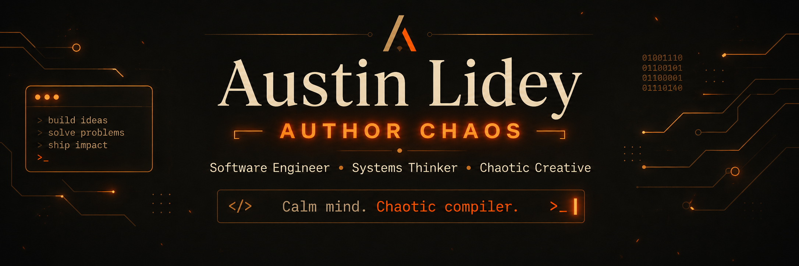
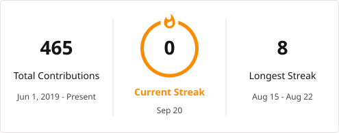

<div align="center">

<p align="center">
  
</p>


<br />
</div>

---

## `whoami`

```python
austin = {
    "alias": "Author Chaos",
    "role": "Software Engineer",
    "class": "Chaotic Creative",
    "alignment": "Pragmatic Good",
    "currently_building": [
        "AI-native software",
        "self-hosted systems",
        "developer tools",
        "family infrastructure",
        "games and questionable experiments",
    ],
    "operating_system": "Curiosity",
    "debug_strategy": "Stare at it until the machine confesses",
}
```
<html>

<p align="center">
  <a href="https://github.com/austinlidey">
    
  </a>

  <a href="https://authorchaos.com">
    
  </a>

  <a href="https://linkedin.com/in/austinlidey">
    
  </a>
</p>
</html>

<br />

I build software, systems, tools, and occasionally entire fictional economies. My work tends to live somewhere between:

* *This solves a real problem.*
* *Why does this not already exist?*
* *This may have gotten **slightly** out of hand.*

I care less about collecting technologies and more about using the right ones to make something **clearer, faster, safer, or genuinely more useful**.

<html>
<blockquote> <i>TL;DR about me is that I make every solution <u>simple</u>, <b>useful</b>, <i>slightly unhinged</i>.</blockquote>
</html>

---

### My operating philosophy

**Clarity beats cleverness.**
Code should make the next person feel capable, not impressed.

**Earn the abstraction.**
Do the work manually. Learn where it hurts. Automate what deserves to survive.

**Complexity is debt with excellent marketing.**
Every dependency, service, layer, and process must justify its existence.

**Systems should reduce cognitive load.**
The machine should remember the ritual so the human can focus on judgment.

**Build for reality.**
Production is where elegant theories meet users, latency, malformed input, and Tuesday.

**Ship, then sharpen.**
Momentum creates information. Information creates better decisions.

---

## `current_quests`

```yaml
quests:
  - build private, local-first AI systems
  - design software that explains itself
  - create tools for people who hate managing tools
  - turn repeated work into reliable infrastructure
  - make AI a collaborator, not a slot machine
  - build ambitious things without worshipping complexity
```

Current rabbit holes include:

* AI-native software engineering
* Local models, RAG, agents, and private knowledge systems
* Developer experience and automation
* Distributed systems and self-hosted infrastructure
* Functional testing and engineering safety
* Game systems, simulated economies, and multiplayer chaos
* Software resurrection: giving abandoned ideas modern capabilities

---

## `tools_of_the_trade`

<div align="center">


</div>

<br />

I reach for tools like:

```text
Python        → automation, AI, data, tooling
C# / .NET     → durable applications and systems
TypeScript    → modern web experiences
React         → interfaces people can actually use
PostgreSQL    → data that intends to remain data
Docker        → controlled chaos in labeled boxes
Unreal Engine → very expensive ways to move polygons
```

But the stack is never the identity.

> A tool is good when it disappears into the work.

---

## `things_i_build`

### 🧠 Intelligent systems

Private AI infrastructure, document ingestion, retrieval systems, local models, agents, and tools that turn scattered information into usable knowledge.

### 🛠️ Developer tools

Utilities, libraries, workflow automation, parsers, internal platforms, and systems that remove friction without hiding important behavior.

### 🏠 Human infrastructure

Family applications, home systems, personal knowledge tools, planning software, and technology designed around actual daily life.

### 🎮 Constructed chaos

Games, simulations, fictional markets, emergent systems, and strange little worlds where players inevitably discover exploits I never imagined.

### 🧪 Experiments

Some projects become products.

Some become lessons.

Some become seventeen Docker containers and a story.

All are useful.

---

## `rules_for_building`

| Rule                             | Meaning                                              |
| -------------------------------- | ---------------------------------------------------- |
| **Reduce before you automate**   | A bad process running faster is still a bad process. |
| **Keep the sharp edges visible** | Convenience should not disguise risk.                |
| **Prefer boring foundations**    | Save innovation for the parts users can feel.        |
| **Design for the next decision** | Good systems help humans know what to do next.       |
| **Build escape hatches**         | Every abstraction eventually leaks.                  |
| **Name things honestly**         | Confusion often begins in the vocabulary.            |
| **Leave the campsite better**    | Improve the code, docs, process, or understanding.   |
| **Know when to stop**            | The final 10% can contain 90% of the nonsense.       |

---

## `github_activity`

<p align="center">
  <a href="https://github.com/austinlidey">
    
  </a>
  <a href="https://github.com/austinlidey">
    
  </a>
</p>

<p align="center">
  <a href="https://github.com/austinlidey">
    
  </a>
</p>

---

## `currently`

```javascript
while (alive) {
    learn();
    build();
    simplify();
    questionAssumptions();

    if (process.isNeedlesslyComplicated()) {
        process.deleteSomething();
    }

    ship();
}
```

---

## `transmission`

<div align="center">

### Calm in the mind. Chaos in the workshop.

**Build deliberately. Experiment recklessly. Document the weird parts.**

<br />

```text
May your builds be green,
your abstractions be earned,
and your logs contain the answer.
```

</div>
